# 2026-08-04 Unitree G1 자율학습 및 MuJoCo 실습

## 0. 실습 개요

- 실습일: 2026-08-04
- 플랫폼: Unitree G1
- 환경: Ubuntu 22.04 / ROS 2 Humble / Python 3.10+ / MuJoCo
- 실습 내용:
  1. G1 MuJoCo 기본 보행 실행
  2. ROS2 Low State / Mode 상태 토픽 조사
  3. 특정 관절 상태 추적
  4. `/g1/lowstate` rosbag 기록
  5. 보행 파라미터 `vx` 변경 실험
  6. High-level API 상태 전이 확인
  7. 상체 모션 시퀀스 코드 작성 및 시뮬레이션 관찰

---

# 1. 교재 2.5 자율학습 미션 — 구조와 균형 개념 정리

> 아래 내용은 교재 기반 개념 정리이다. 사람 몸으로 직접 수행하는 지지 영역 체감 실험은 실제 수행 후 결과를 추가한다.

## 1-1. 미션 ① 관절 지도 정리

| 부위 | 구성 | 역할 |
|---|---|---|
| 하체 | 다리당 6자유도 = 고관절 3 + 무릎 1 + 발목 2 | 보행과 균형 |
| 허리 | 상체 회전·기울임 | 균형 보상, 작업 공간 확대 |
| 팔 | 다관절 구조 | 제스처·상체 모션·조작 |
| IMU | 몸통 기울기·각속도 측정 | 실시간 균형 상태 확인 |

다리 1개의 6자유도는 다음과 같이 이해하였다.

- Hip roll: 다리를 좌우로 움직임
- Hip pitch: 다리를 앞뒤로 움직임
- Hip yaw: 다리를 안팎으로 회전
- Knee: 다리를 접고 펴기
- Ankle pitch: 발끝을 들거나 내리기
- Ankle roll: 발바닥을 좌우로 기울이기

## 1-2. 미션 ② 지지 영역 체감 실험

실제 사람 실험 결과는 수행 후 작성한다.

개념적으로는 두 발을 벌리면 지지 영역이 넓어져 안정성이 증가하고, 한 발로 서면 지지 영역이 작아져 팔·상체·발목의 자세 보상이 커진다. 상체를 더 기울여 자세 보상만으로 무게중심을 지지 영역 안에 유지할 수 없게 되면 발을 내딛는 스텝으로 전환된다.

## 1-3. 미션 ③ Go2 ↔ G1 대응표

| Go2 주간 | G1 주간 |
|---|---|
| `topic list`로 토픽 지도부터 조사 | ROS2 CLI로 `/g1/lowstate`, `/g1/mode` 등 상태 토픽 조사 |
| Gazebo에서 검증 후 실기체 | MuJoCo에서 먼저 검증 후 실기체 |
| StandUp → 대기 → Move → StopMove | 현재 상태 확인 → 기립/균형 전이 → 동작/보행 → Stop/Damp |
| 문제 발생 시 리모컨이 코드보다 우선 | 동일하며 G1은 행어·안전거리·멘토 확인 절차가 더 엄격함 |

## 1-4. 미션 ④ 상태 전이 판별

| 상황 | 판단 | 이유 |
|---|---|---|
| 행어 거치·준비 자세 → 기립 | 가능 | 기립을 위한 정상적인 상태 전이 |
| 엎드린 상태 → 즉시 보행 | 부적절 | 기립·균형 상태를 거치지 않은 상태에서 보행 명령을 보냄 |
| 보행 중 비상정지 | 가능/필요 | 이상 상황에서는 안전 정지가 최우선 |
| 안정된 기립 상태 → 팔 모션 | 가능 | 현재 상태에서 의미 있는 상체 동작 명령 |

---

# 2. MuJoCo 기본 보행 실행

`examples/01_walk_demo.py`를 실행하여 G1 29DoF 시뮬레이션 모델의 기본 보행을 확인하였다.

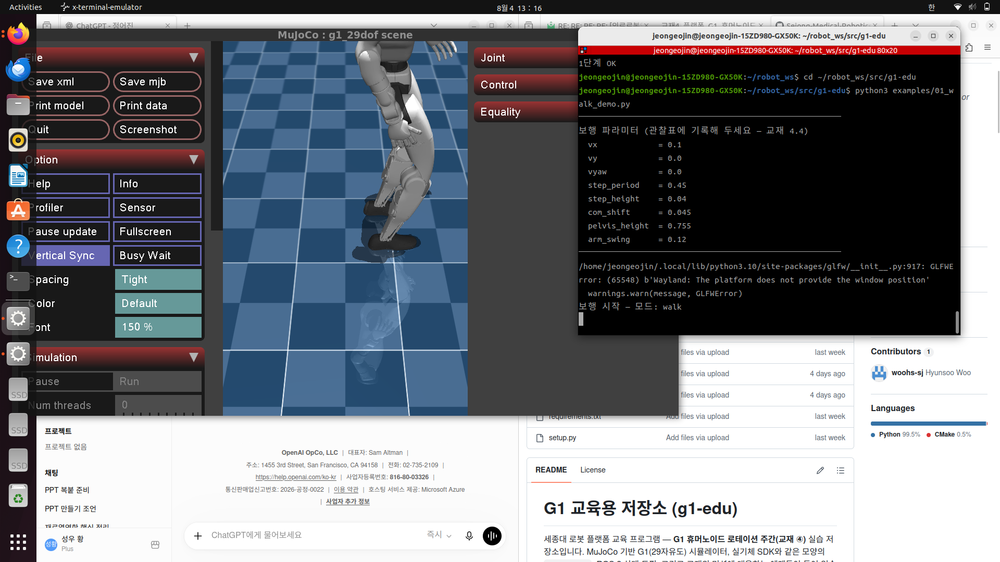

기본 실행에서 표시된 파라미터:

| 파라미터 | 값 | 의미 |
|---|---:|---|
| `vx` | 0.1 | 전진 속도 명령 |
| `vy` | 0.0 | 횡이동 속도 명령 |
| `vyaw` | 0.0 | 회전 속도 명령 |
| `step_period` | 0.45 | 걸음 주기 |
| `step_height` | 0.04 | 발 들어올림 높이 |
| `com_shift` | 0.045 | 좌우 무게중심 이동량 |
| `pelvis_height` | 0.755 | 골반 높이 |
| `arm_swing` | 0.12 | 보행 중 팔 스윙 진폭 |

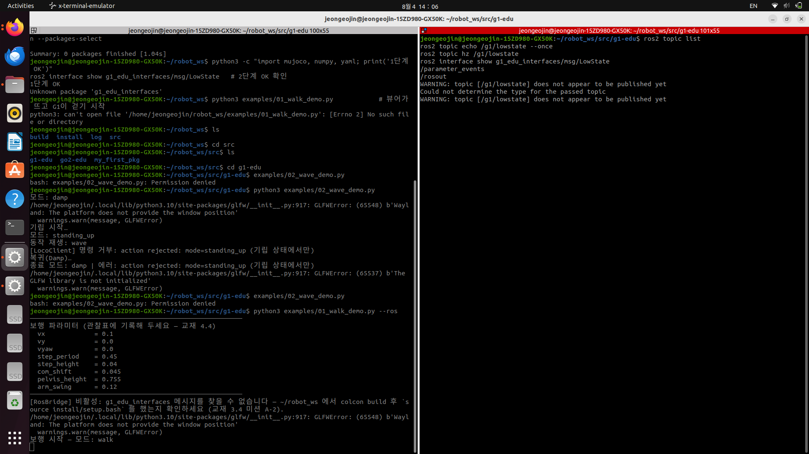

한 실행에서 터미널에 약 **23.6 s 동안 1.40 m 전진, 실측 평균속도 약 0.059 m/s**가 표시되었다. 명령 속도 `vx=0.1 m/s`와 실측 평균속도가 동일하지 않음을 확인하였다.

---

# 3. 교재 3.4 자율학습 미션 A — 상태 토픽 조사

## 3-1. 미션 ① Low State 첫 탐사

ROS Bridge 실행 시 다음 상태 채널이 표시되었다.

- `/g1/lowstate` : 설정상 50 Hz
- `/g1/mode` : 설정상 10 Hz

실제 `ros2 topic hz` 측정에서는 시뮬레이션 실행 속도 영향으로 설정값보다 낮은 값이 관찰되었다.

- `/g1/lowstate`: 약 4.3 Hz
- `/g1/mode`: 약 0.93 Hz

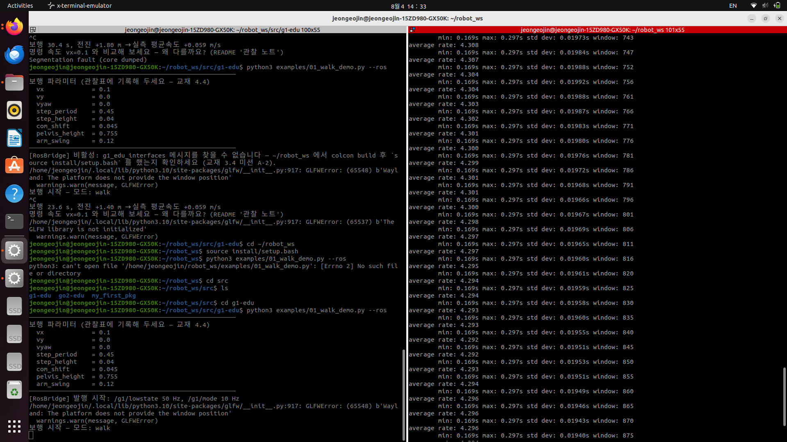

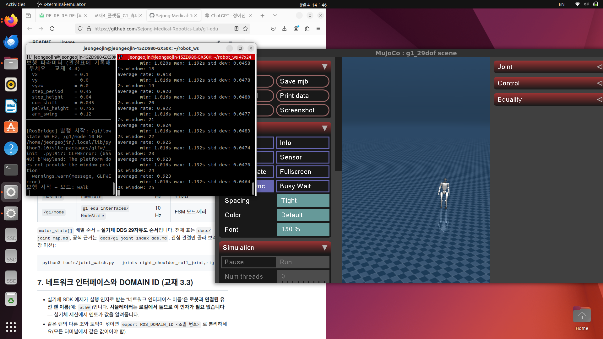

### 조사 질문 ① — Low State에 어떤 값이 있는가?

교육용 시뮬레이터는 29DoF 모델을 사용한다. Low State의 `motor_state`에서는 각 관절마다 다음 상태값을 확인하였다.

- `q`: 현재 관절 각도
- `dq`: 관절 각속도
- `tau_est`: 추정 토크
- `temperature`: 모터 온도

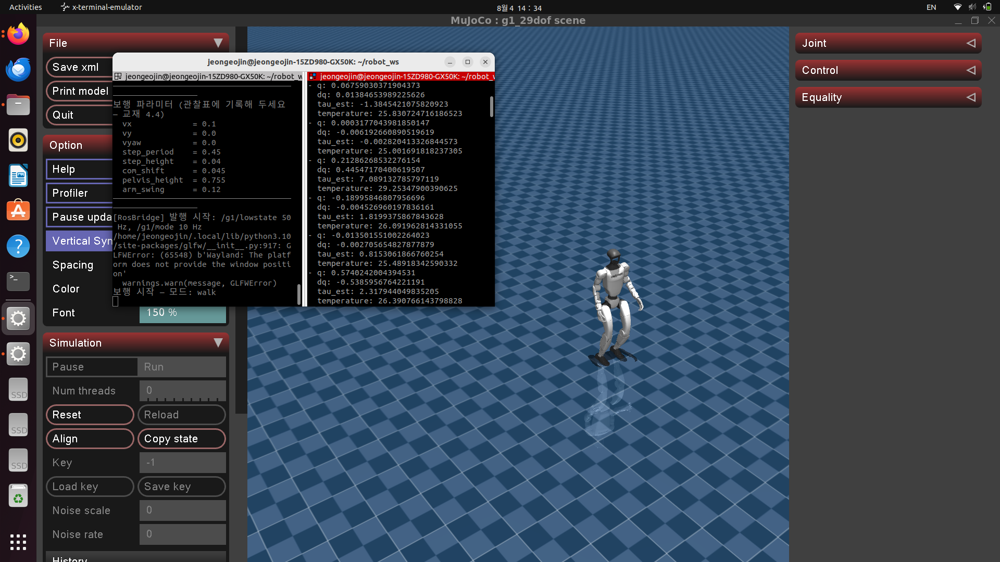

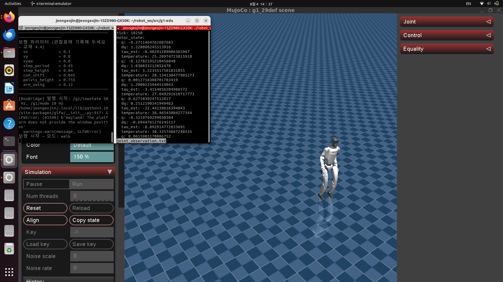

### 조사 질문 ② — 상태 보고 주기는 왜 빠른가?

휴머노이드는 두 발의 좁은 지지 영역 위에서 높은 무게중심을 유지해야 하므로 작은 기울어짐도 지속적으로 감지하고 보정해야 한다. 따라서 관절·IMU 상태를 빠르게 갱신하는 것이 균형 유지에 중요하다고 이해하였다.

### 조사 질문 ③ — DDS 자동 발견 문제와 해결책

DDS는 같은 네트워크의 노드를 자동으로 발견하므로 실습실에서 여러 조가 같은 네트워크를 사용할 경우 다른 조의 노드와 토픽이 함께 보일 수 있다. 이를 분리하기 위해 조별로 서로 다른 `ROS_DOMAIN_ID`를 사용한다.

## 3-2. 미션 ② 관절 하나 추적

`joint_watch.py`를 이용해 `left_ankle_pitch_joint`의 상태를 추적하였다.

관찰 항목:

- `q [rad]`
- `dq [rad/s]`
- `tau [Nm]`

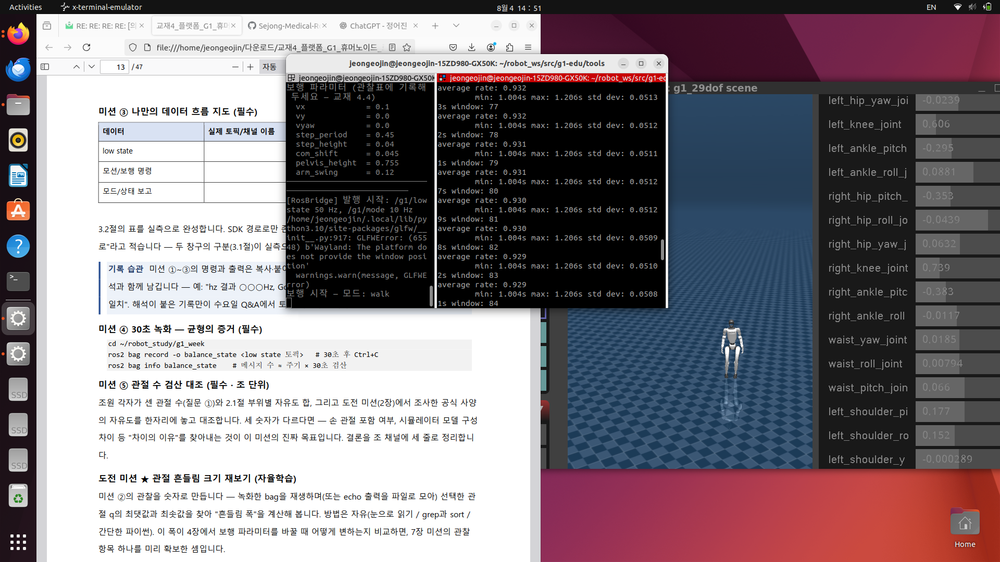

보행 중 발목 관절의 `q`, `dq`, `tau` 값이 지속적으로 변하는 것을 확인하였다. 이는 보행 중 지지 영역과 무게중심을 조절하기 위한 자세 보상과 관련된 것으로 해석하였다.

> 교재의 정확한 조건인 **기립 상태에서 10초간 q 관찰**은 별도로 수행하여 추가 기록하면 더 완전하다.

## 3-3. 미션 ③ 나만의 데이터 흐름 지도

| 데이터 | 실제 토픽/채널 이름 | 타입/방식 | 주기 |
|---|---|---|---|
| Low State | `/g1/lowstate` | `g1_edu_interfaces/msg/LowState` | 설정 50 Hz / 실측 약 4.3 Hz |
| 모션·보행 명령 | LocoClient SDK 경로 | High-level API | 명령 시 호출 |
| 모드·상태 보고 | `/g1/mode` | `g1_edu_interfaces/msg/ModeState` | 설정 10 Hz / 실측 약 0.93 Hz |

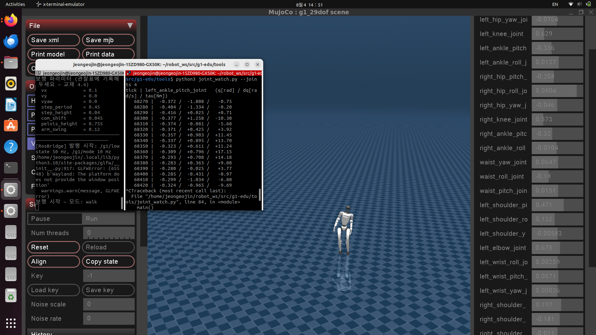

## 3-4. 미션 ④ rosbag 녹화

실행 명령:

```bash
ros2 bag record -o balance_state /g1/lowstate
```

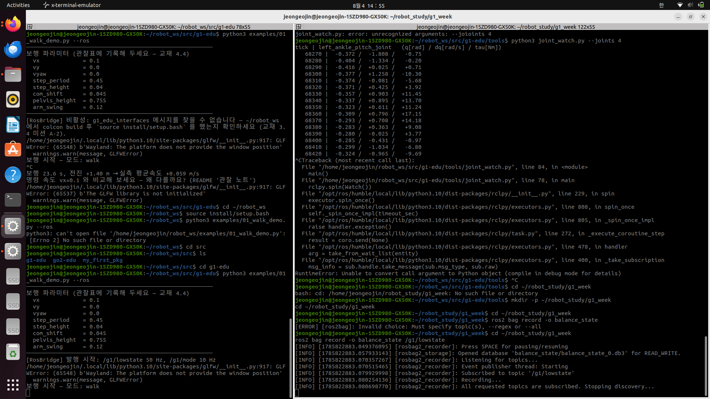

`ros2 bag info balance_state` 확인 결과:

| 항목 | 결과 |
|---|---|
| 파일 | `balance_state_0.db3` |
| Bag size | 약 297.0 KiB |
| Duration | 약 110.29 s |
| Messages | 461 |
| Topic | `/g1/lowstate` |
| Type | `g1_edu_interfaces/msg/LowState` |

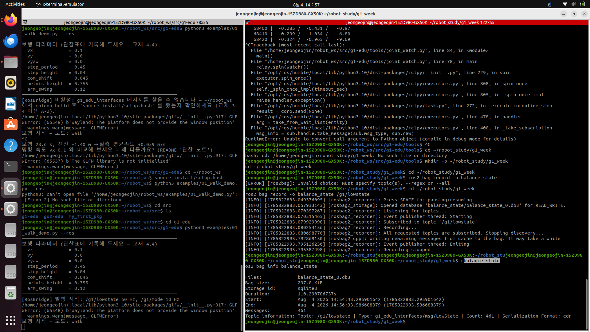

> 교재에서는 30초 녹화를 요구하지만 이번 실행은 약 110.29초 동안 기록되었다. 교재 조건을 정확히 맞추려면 추후 30초 녹화를 한 번 더 수행한다.

## 3-5. 미션 ⑤ 관절 수 검산

이번 교육용 시뮬레이터는 29DoF 모델을 사용한다. 교재의 하체 구성은 다리당 6자유도이며, 여기에 허리와 팔 자유도가 더해진다. 공식 실기체 사양과의 최종 대조는 손 관절 포함 여부와 모델 구성 차이를 확인하여 추가 정리한다.

---

# 4. 교재 4장 — 보행 파라미터 관찰

## 4-1. 파라미터 설정 파일 확인

`config/gait_params.yaml`에서 보행 파라미터를 확인하고 전진 속도 `vx`를 변경하였다.

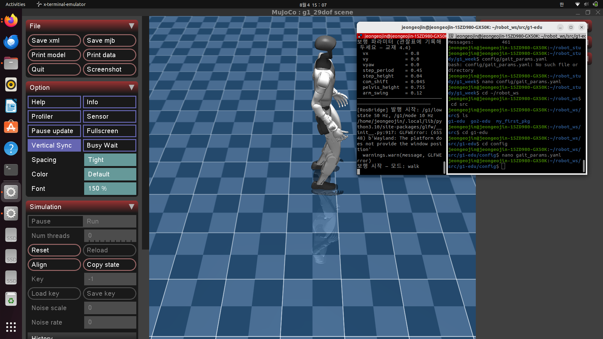

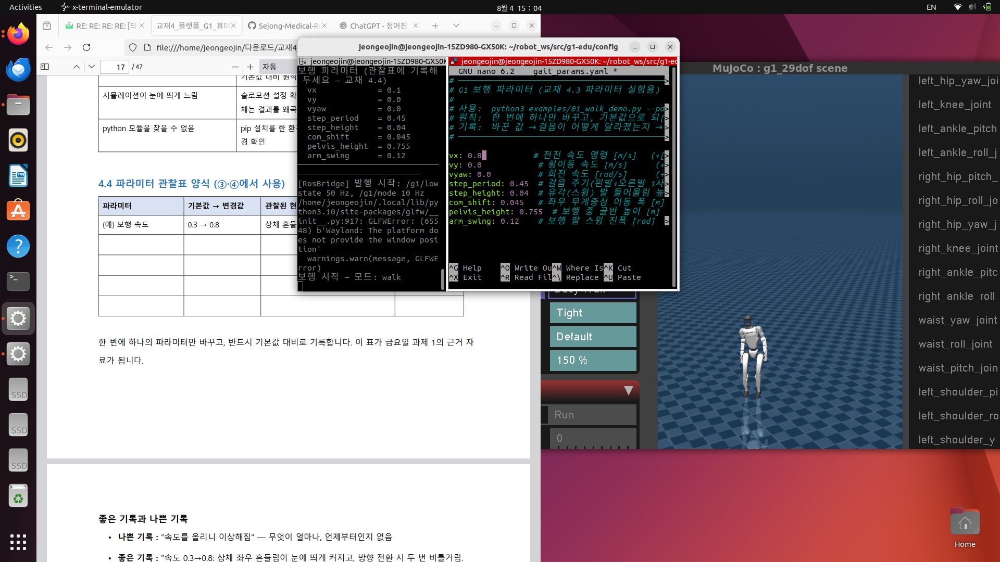

## 4-2. `vx=0.8` 실험

기본값 `vx=0.1`에서 `vx=0.8`로 변경하여 MuJoCo 보행을 실행하였다.

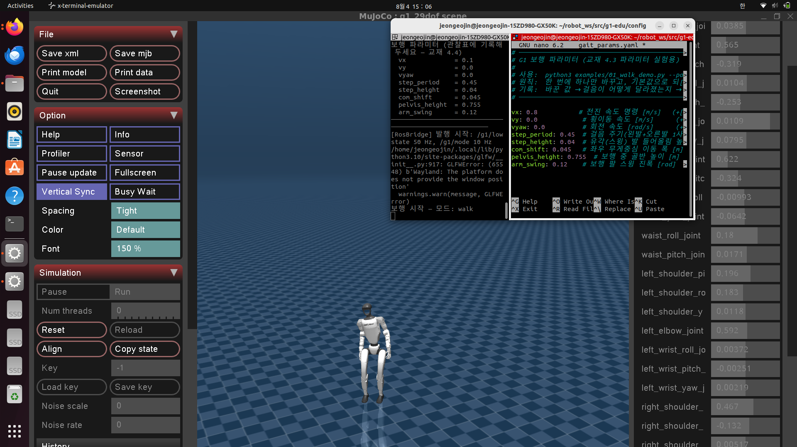

실행 과정에서 속도를 크게 높였을 때 자세가 불안정해지고 낙상 판정(`FALL_DETECTED`)이 발생한 사례를 확인하였다.

### 4.4 파라미터 관찰표

| 파라미터 | 기본값 → 변경값 | 관찰된 현상 | 넘어짐 |
|---|---|---|---|
| `vx` | 0.1 → 0.8 | 전진 속도를 크게 올리자 자세 안정성이 감소하고 낙상 판정이 발생함 | O |
| `vx` | 0.8 → 0.5 | 재실험을 시작했으나 최종 결과 화면은 별도 기록 필요 | 미확인 |
| `step_period` | 0.45 → 미실험 | 추가 실험 예정 | - |
| `step_height` | 0.04 → 미실험 | 추가 실험 예정 | - |
| `com_shift` | 0.045 → 미실험 | 추가 실험 예정 | - |

> 교재의 체크포인트는 **파라미터 3개 이상, 각 2회 이상 변경** 및 **관찰표 5행 이상**이다. 현재 캡처로 확실히 결과를 말할 수 있는 것은 `vx` 실험이며, 나머지 행은 추가 실험 후 결과를 채운다.

---

# 5. 교재 5.2 자율학습 미션 B — High-level API 상태 전이

## 5-1. 상태 전이 이해

상체 모션 예제를 통해 다음 흐름을 확인하였다.

```text
Damp
  ↓
StandUp
  ↓
상체 Action
  ↓
Damp
```

상태 전이가 끝나기 전에 다음 동작 명령을 보내면 현재 모드와 맞지 않아 명령이 거부될 수 있다.

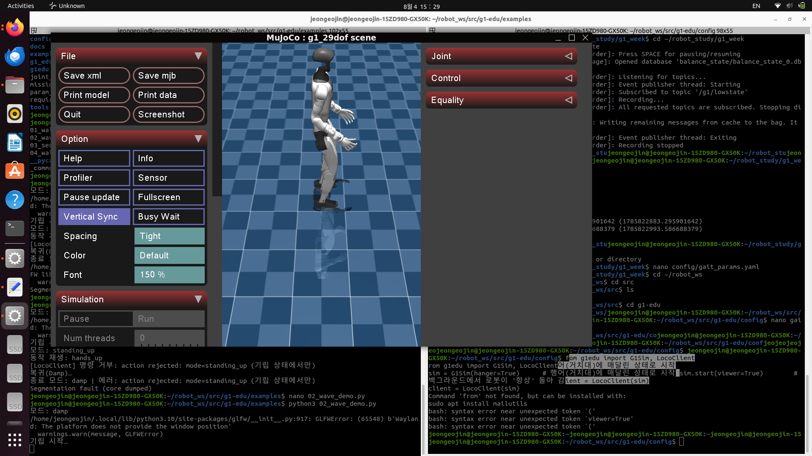

실제 실행 중 `standing_up` 상태에서 상체 동작 명령이 전달되어 `action rejected`가 발생한 사례를 확인하였다. 이를 통해 **현재 상태 확인 → 전이 명령 → 전이 완료 대기 → 다음 동작** 순서가 중요함을 확인하였다.

## 5-2. 실패 경로 정리

| 실패 상황 | 코드에서 기대되는 처리 | 최종 안전 관점 |
|---|---|---|
| 기립 전이 중 실패 | 예외 처리 후 안전 복귀 코드 실행 | `Damp()`로 수렴하도록 구성 |
| 모션 실행 중 Ctrl+C | 종료 과정에서 `finally` 실행 | `Damp()` 호출로 안전 복귀 시도 |
| 통신 끊김 | 예외가 발생하면 `Damp()` 호출 시도 | 통신 자체가 끊긴 경우 실제 명령 전달은 보장할 수 없으므로 실기체에서는 멘토·리모컨 대응 필요 |

---

# 6. 교재 7장 준비 — 나만의 모션 시퀀스

## 6-1. 시퀀스 템플릿 분석

`03_sequence_template.py`의 `SEQUENCE` 구조를 확인하였다.

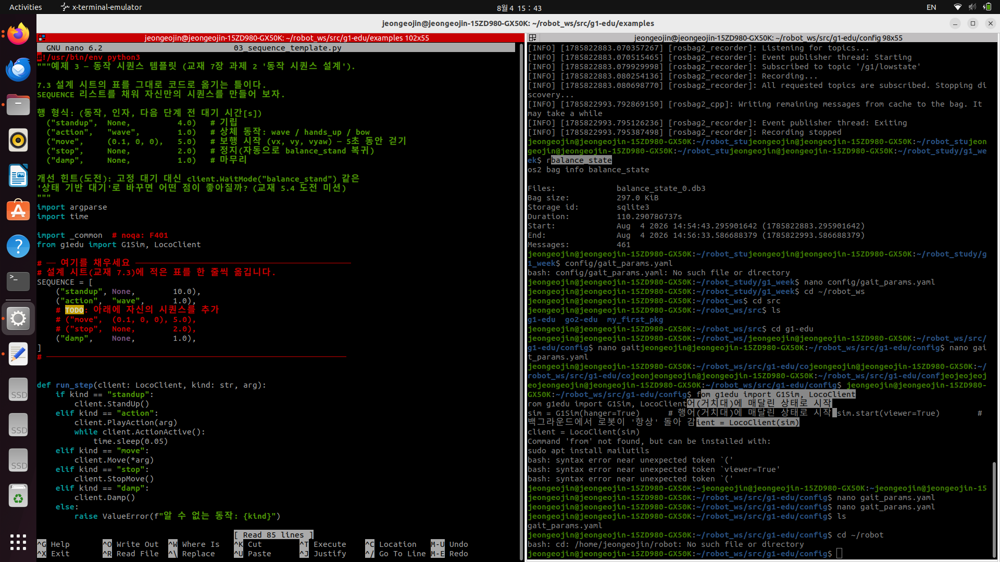

## 6-2. 사용자 시퀀스 작성

작성한 시퀀스에서 다음 상체 동작을 연결하였다.

```text
StandUp
→ Wave
→ Hands Up
→ Bow
→ (Move / Stop)
→ Damp
```

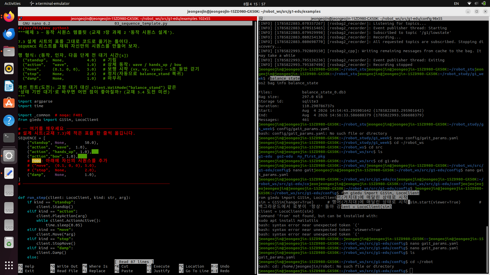

### 시퀀스 설계표

| 순서 | 명령 | 대기/조건 | 기대 상태 | 실패 시 경로 |
|---:|---|---|---|---|
| 1 | StandUp | 코드에 설정된 대기 시간 | 기립/균형 상태 | 오류 시 Damp |
| 2 | Wave | Action 완료 대기 | 손 흔들기 동작 완료 | 오류 시 Damp |
| 3 | Hands Up | Action 완료 대기 | 양팔 들기 완료 | 오류 시 Damp |
| 4 | Bow | Action 완료 대기 | 숙이기 동작 완료 | 오류 시 Damp |
| 5 | Move / Stop | 시뮬레이션에서만 검증 | 이동 후 정지 | Stop 후 Damp |
| 6 | Damp | 마무리 | 알려진 안전 상태 | - |

## 6-3. 시뮬레이션 동작 관찰

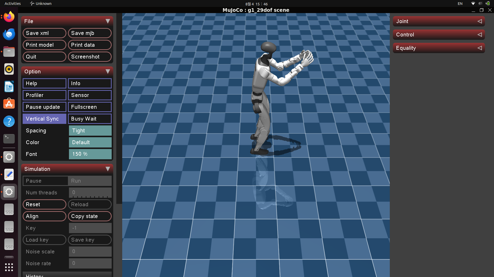

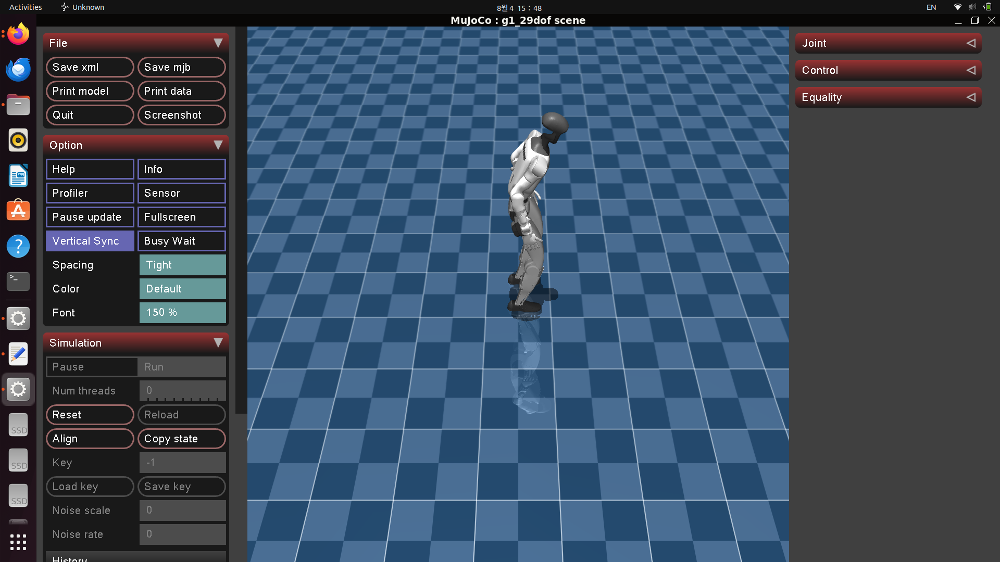

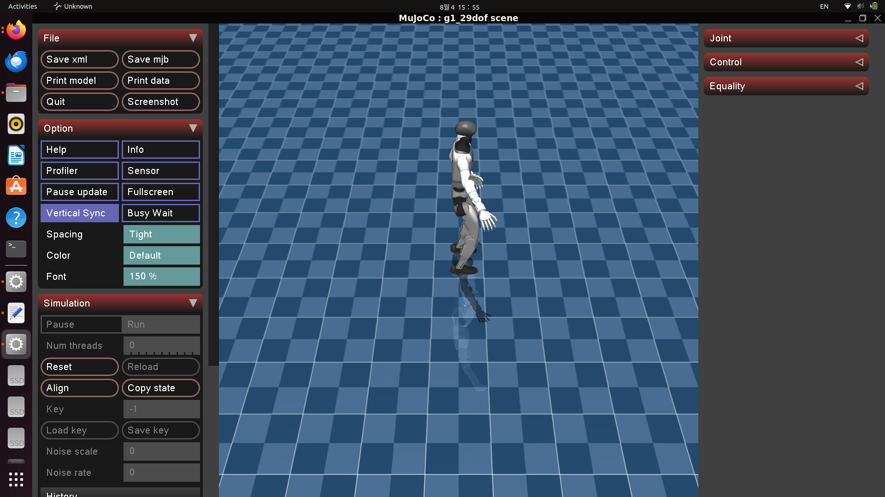

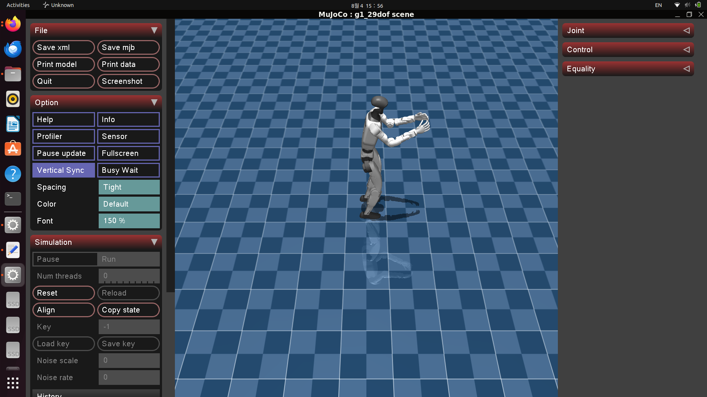


상체 동작들이 연속적으로 실행되는 모습을 MuJoCo에서 관찰하였다. 실기체 적용 전에는 시뮬레이션에서 상태 전이와 복귀 경로를 먼저 검증해야 한다.

---

# 7. 8/4 실습 결과 요약

이번 실습에서 다음 내용을 확인하였다.

- MuJoCo에서 G1 기본 보행 실행
- `/g1/lowstate`, `/g1/mode` 상태 토픽 확인
- Low State의 `q`, `dq`, `tau_est`, `temperature` 관찰
- 왼쪽 발목 관절의 상태 변화 추적
- `/g1/lowstate` rosbag 기록 및 정보 검산
- 보행 파라미터 `vx` 변경 및 불안정/낙상 사례 관찰
- High-level API의 상태 전이 순서와 명령 거부 사례 확인
- `Wave → Hands Up → Bow`를 포함한 모션 시퀀스 작성 및 MuJoCo 관찰

## 추가로 보완할 항목

- 교재 2.5의 사람 지지 영역 체감 실험 실제 수행 결과
- 교재 조건에 맞춘 기립 상태 관절 q 10초 관찰
- 정확히 30초 동안의 `balance_state` rosbag 기록
- 공식 실기체 사양과 29DoF 시뮬레이터 관절 수 대조
- 4.4 관찰표를 위한 추가 파라미터 2개 이상 실험 및 각 2회 이상 변경
- 모션 중 Ctrl+C 실험 결과 기록
- 7장 과제의 최종 판정 및 실기체 적용은 멘토 절차에 따라 별도 수행
